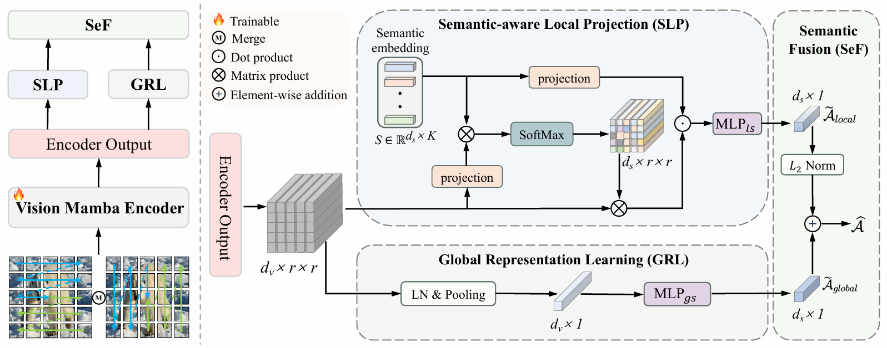

<div align="center">
<h1> ZeroMamba [AAAI'25]🎉 </h1>
<h3> ZeroMamba: Exploring Visual State Space Model for Zero-Shot Learning </h3>
</div>


## News
* **` Dec. 10th, 2024`:** This repository contains the training and testing code for the AAAI'25 paper titled with "***ZeroMamba: Exploring Visual State Space Model for Zero-Shot Learning***" ([arXiv](https://arxiv.org/pdf/2408.14868)). We will release the entire codes in the following days.


## Overview
### Framework
<div align="center"></div>

### Main Results
Results of our released models using various evaluation protocols on three datasets, both in the CZSL and GZSL settings.

| Dataset | Acc(CZSL) | U(GZSL) | S(GZSL) | H(GZSL) |
| :-----: | :-------: | :-----: | :-----: | :-----: |
|   CUB   |   80.0    |  72.1   |  76.4   |  74.2   |
|   SUN   |   72.4    |  56.5   |  41.4   |  47.7   |
|  AWA2   |   71.9    |  67.9   |  87.6   |  76.5   |


## Environments setup 

**Note: We highly recommend that you adhere to the following steps.**

- **Python & PyTorch**
  
  ```shell
  conda create -n zeromamba python=3.10.13
  conda activate zeromamba
  conda install pytorch==2.1.1 torchvision==0.16.1 torchaudio==2.1.1 pytorch- cuda=11.8 -c pytorch -c nvidia
  ```
  
- **Mamba dependencies**

  - download [mamba_ssm-1.1.1](https://github.com/state-spaces/mamba/releases/download/v1.1.1/mamba_ssm-1.1.1+cu118torch2.1cxx11abiFALSE-cp310-cp310-linux_x86_64.whl)
    - `pip install <your file path> `

  - download [casual_conv1d-1.1.0](https://github.com/Dao-AILab/causal-conv1d/releases/download/v1.1.0/causal_conv1d-1.1.0+cu118torch2.1cxx11abiFALSE-cp310-cp310-linux_x86_64.whl)
    - `pip install <your file path> `

- **Vision Mamba dependencies**

  - `cp -r ZeroMamba/VisionMambaModels/Vim/mamba_ssm <your env's site-packages path>`
  - `cd ZeroMamba/VisionMambaModels/VMamba/kernels/selective_scan && pip install .`

- **Other dependencies**

```
git clone git@github.com:DingjieFu/ZeroMamba.git
cd ZeroMamba
pip install -r requirements.txt
```


## Datasets Preparation
The structure:
```
ZeroMamba/
├── data
│   ├── attribute
│   ├── dataset
│   │   ├── AWA2
│   │   │   ├── Animals_with_Attributes2
│   │   │   └── ...
│   │   ├── CUB
│   │   │   ├── CUB_200_2011
│   │   │   └── ...
│   │   ├── SUN
│   │   │   ├── images
│   │   │   └── ...
│   │   ├── xlsa
│   │   └── ...
│   ├── w2v
│   └── ...
├── utils
└── ...
```


## Training

Running following commands in `./scripts/train.sh`, download the pre-trained model [here](https://github.com/MzeroMiko/VMamba/releases/download/%23v2cls/vssm_small_0229_ckpt_epoch_222.pth) and place it under `./checkpoints`.
```
# AWA2
python train.py --model_name VMamba-S --model vmambav2_small_224\
    --ckpt vssm_small_0229_ckpt_epoch_222.pth --cfg  vmambav2_small_224.yaml\
    --dataset AWA2 --gamma 0.98 --input_size 448 --batch_size 32\
    --backbone_lr 1e-3 --head_lr 1e-3 --head2_lr 1e-4 --loss_L1 0.0
# CUB
python train.py --model_name VMamba-S --model vmambav2_small_224\
    --ckpt vssm_small_0229_ckpt_epoch_222.pth --cfg  vmambav2_small_224.yaml\
    --dataset CUB --gamma 0.3 --input_size 448 --batch_size 32\
    --backbone_lr 1e-3 --head_lr 1e-3 --head2_lr 1e-4 --loss_L1 1.0
# SUN
python train.py --model_name VMamba-S --model vmambav2_small_224\
    --ckpt vssm_small_0229_ckpt_epoch_222.pth --cfg  vmambav2_small_224.yaml\
    --dataset SUN --gamma 0.35 --input_size 448 --batch_size 32\
    --backbone_lr 1e-3 --head_lr 1e-3 --head2_lr 1e-4 --loss_L1 0.2
```


## Testing

### Preparing Model

We provide trained models([Google Drive](https://drive.google.com/drive/folders/1VtmU_HqvjtdyNRyp0ou3RJwB3-CmdXGv?usp=drive_link))on three different datasets: [CUB](http://www.vision.caltech.edu/visipedia/CUB-200-2011.html), [SUN](http://cs.brown.edu/~gmpatter/sunattributes.html), [AWA2](http://cvml.ist.ac.at/AwA2/) in the CZSL and GZSL settings. Download and place them under `./checkpoints`

### Testing Script
Running following commands in `./scripts/test.sh`
```
# AWA2
python test.py --dataset AWA2 --gamma 0.98
# CUB
python test.py --dataset CUB --gamma 0.3
# SUN
python test.py --dataset SUN --gamma 0.35
```

## Acknowledgement

This project is partly based on VMamba ([github](https://github.com/MzeroMiko/VMamba)). Thanks for their wonderful works.

## Citation

If you find ZeroMamba is useful in your research or applications, please consider giving us a star 🌟 and citing it by the following BibTeX entry.

```bibtex
@article{hou2024zeromamba,
  title={ZeroMamba: Exploring Visual State Space Model for Zero-Shot Learning},
  author={Hou, Wenjin and Fu, Dingjie and Li, Kun and Chen, Shiming and Fan, Hehe and Yang, Yi},
  journal={arXiv preprint arXiv:2408.14868},
  year={2024}
}
```

